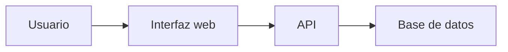

# Biblioteca Digital


Biblioteca Digital es una aplicación para gestionar libros, usuarios y préstamos de una biblioteca.
El proyecto permite consultar libros disponibles y registrar los préstamos de manera sencilla.

## Tabla de contenidos

* [Descripción](#descripción)
* [Instalación](#instalación)
* [Uso](#uso)
* [Funcionalidades](#funcionalidades)
* [Pendientes](#pendientes)
* [Arquitectura](#arquitectura)
* [Contribuidores](#contribuidores)

## Descripción

El proyecto busca facilitar la administración de una biblioteca mediante un sistema digital.
Permite organizar los libros y controlar los préstamos realizados por los usuarios.

## Instalación

```bash
git clone https://github.com/sempai3-3/laboratorio-readme.git
cd laboratorio-readme
npm install
```

## Uso

```bash
npm install
npm start
```

Luego abre la aplicación en el navegador para comenzar a utilizar el sistema.

## Funcionalidades

| Funcionalidad          | Estado      |
| ---------------------- | ----------- |
| Registro de libros     | Listo       |
| Consulta de libros     | Listo       |
| Registro de usuarios   | Listo       |
| Gestión de préstamos   | En progreso |
| Generación de reportes | En progreso |

## Pendientes

* [x] Crear estructura del proyecto
* [x] Registrar libros
* [x] Consultar libros
* [ ] Completar gestión de préstamos
* [ ] Agregar reportes
* [ ] Realizar pruebas finales

## Arquitectura



## Contribuidores

| Nombre                | GitHub                                     |
| --------------------- | ------------------------------------------ |
| David Yhamil Nuñez H. | [@sempai3-3](https://github.com/sempai3-3) |
